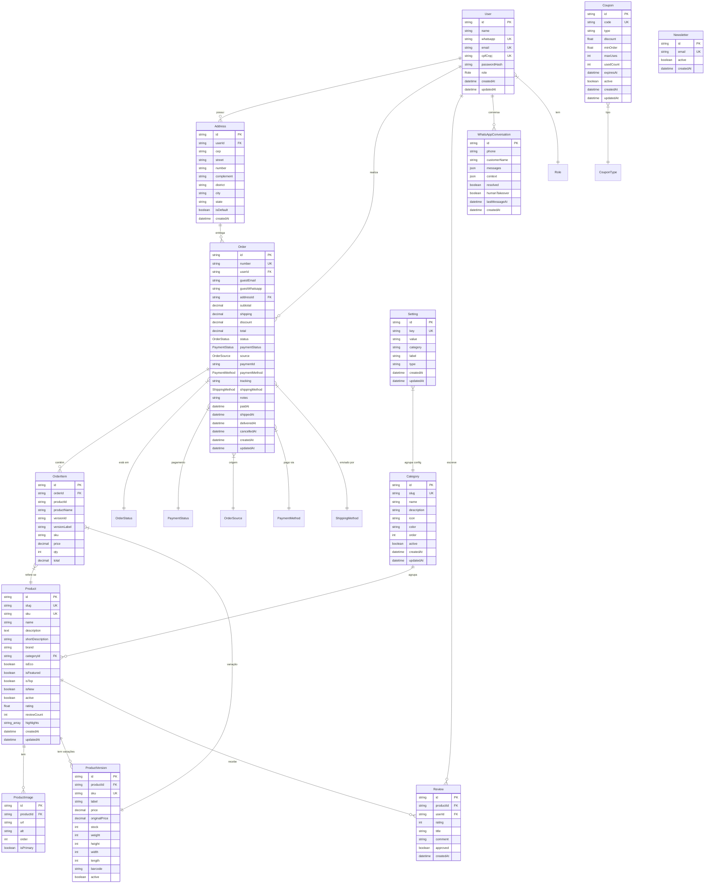
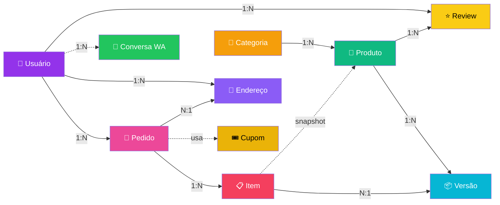
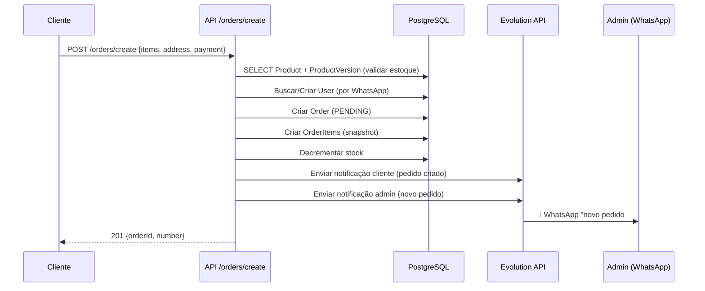
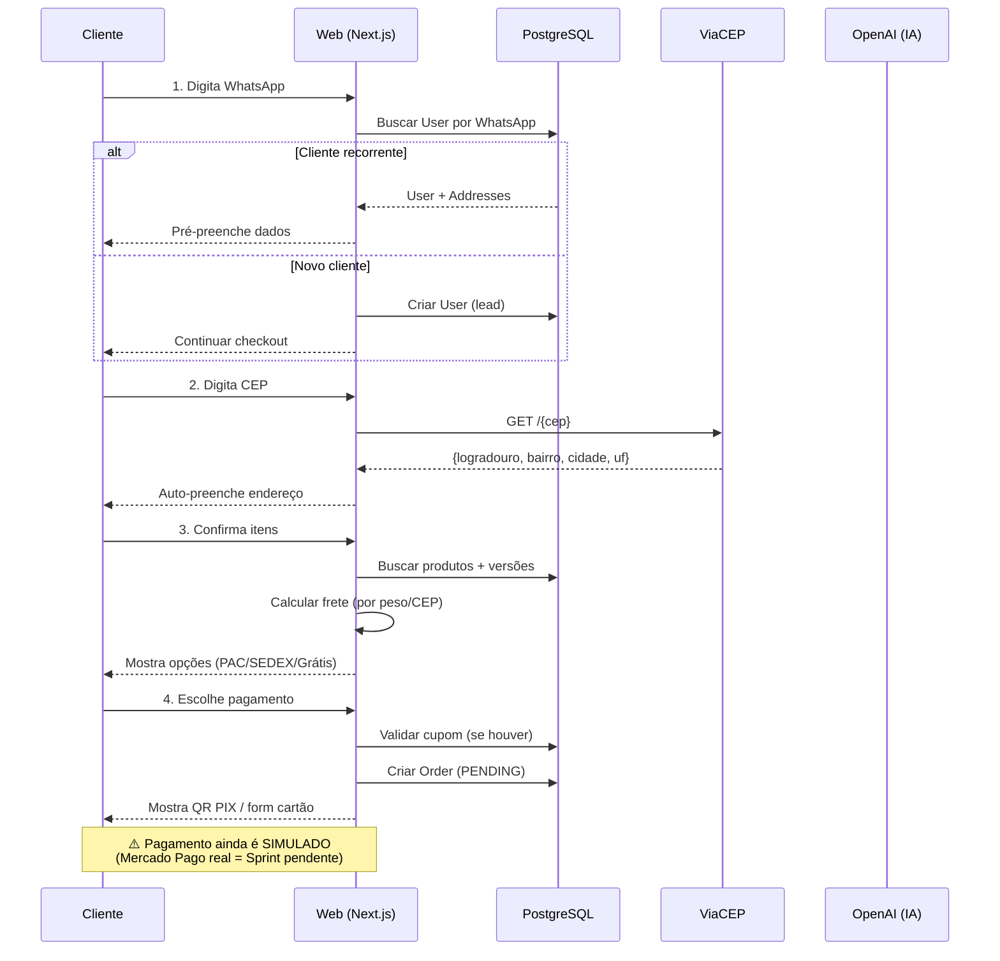
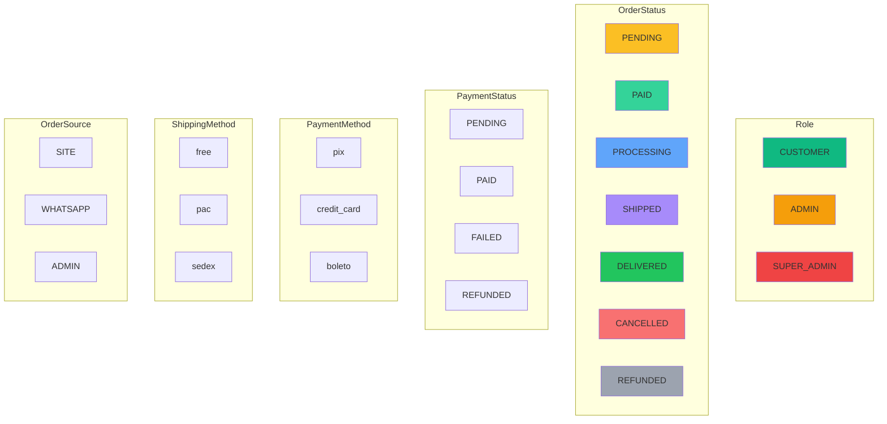

# Diagrama Relacional — Becker E-commerce

> Diagrama Entidade-Relacionamento do banco PostgreSQL.
> Renderiza em qualquer visualizador Markdown compatível com Mermaid (GitHub, GitLab, VSCode, Obsidian, etc).

---

## Diagrama ER Completo

---

## Diagrama Simplificado (foco em negócio)

---

## Fluxo de Dados: Criação de Pedido

---

## Fluxo de Dados: Checkout Completo

---

## Cardinalidades Resumidas

| De | Para | Tipo | Descrição |
|----|------|------|-----------|
| User | Address | 1:N | Um usuário tem vários endereços |
| User | Order | 1:N | Um usuário tem vários pedidos |
| User | Review | 1:N | Um usuário escreve várias reviews |
| Category | Product | 1:N | Uma categoria tem vários produtos |
| Product | ProductImage | 1:N | Um produto tem várias imagens |
| Product | ProductVersion | 1:N | Um produto tem várias versões (tamanho, etc) |
| Product | Review | 1:N | Um produto tem várias reviews |
| Address | Order | 1:N | Um endereço é usado em vários pedidos |
| Order | OrderItem | 1:N | Um pedido tem vários itens |
| OrderItem | ProductVersion | N:1 | Cada item refere a uma versão |
| OrderItem | Product | N:1 (snapshot) | Refere ao produto (mas salva nome) |

---

## Enums (resumo visual)

---

## Índices Estratégicos

| Tabela | Índice | Motivo |
|--------|--------|--------|
| `User` | `whatsapp` (unique) | Login OTP e busca de cliente |
| `Product` | `slug` (unique) | URL pública |
| `Product` | `categoryId` | Filtro por categoria |
| `Product` | `isTop`, `isFeatured` | Vitrine / home |
| `Order` | `number` (unique) | Rastreamento público |
| `Order` | `userId` | "Meus pedidos" |
| `Order` | `status` | Painel admin (filtros) |
| `Order` | `createdAt` | Relatórios por período |
| `OrderItem` | `orderId` | Join com pedido |
| `ProductVersion` | `sku` (unique) | Integração com estoque |
| `Review` | `(productId, userId)` (unique) | 1 review por usuário/produto |
| `WhatsAppConversation` | `phone` | Buscar histórico do cliente |
| `WhatsAppConversation` | `lastMessageAt` | Dashboard conversas |
| `Setting` | `key` (unique) | Lookup de config |

---

**Última atualização:** 08/08/2026
